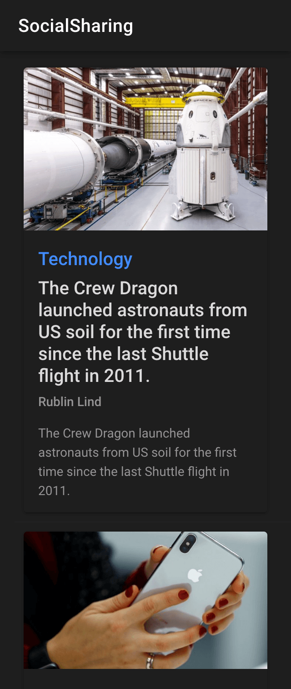

# Ionic React Social Sharing

A sample Ionic React app that demonstrates a social-style news feed with post details, native sharing, and a parallax header effect. Built with Ionic 8, React 19, and Capacitor 8.

## Features

- **Post list** — Card-based feed with image, category, title, author, and summary
- **Post details** — Full article view with scrollable content
- **Share a post** — Native share sheet via `@ionic-native/social-sharing` (title, image, and source URL)
- **Parallax header** — Collapsing hero image on the details screen using [ionic-react-header-parallax](https://github.com/ahmnouira/ionic-react-header-parallax)
- **Dark mode** — System-aware theme via Ionic's dark palette

## Demo

### Video walkthrough

<video src="demos/1.mp4" controls width="600">
  Your browser does not support the video tag. <a href="demos/1.mp4">Download the demo video</a>.
</video>

### Screenshots

| Post list | Post details (hero) |
| --- | --- |
|  |  |

| Parallax scroll | Share & actions |
| --- | --- |
|  |  |

## Tech stack

- [Ionic React](https://ionicframework.com/docs/react) 8
- [React](https://react.dev/) 19
- [Capacitor](https://capacitorjs.com/) 8
- [Vite](https://vitejs.dev/) + TypeScript
- [@ionic-native/social-sharing](https://github.com/danielsogl/awesome-cordova-plugins/tree/master/src/%40ionic-native/social-sharing) — native share API
- [ionic-react-header-parallax](https://github.com/ahmnouira/ionic-react-header-parallax) — parallax header hook

## Getting started

### Prerequisites

- Node.js 18+
- npm (or yarn/pnpm)

For native sharing on a device, you also need:

- [Capacitor native platforms](https://capacitorjs.com/docs/getting-started) (iOS / Android)
- The Cordova Social Sharing plugin installed in your native project

### Install & run (web)

```bash
git clone https://github.com/ahmnouira/ionic-react-social-sharing.git
cd ionic-react-social-sharing
npm install
npm run dev
```

Open the URL shown in the terminal (typically `http://localhost:5173`).

### Build

```bash
npm run build
npm run preview   # preview production build
```

### Tests

```bash
npm run test.unit   # Vitest unit tests
npm run test.e2e    # Cypress e2e tests
npm run lint        # ESLint
```

## Project structure

```
src/
├── components/
│   ├── Post/          # Card UI for a single post
│   ├── PostItem/      # List row linking to post details
│   └── Lorem/         # Placeholder content on details page
├── pages/
│   ├── HomePage/      # Nested routes: list + details
│   ├── PostListPage/  # Feed of posts
│   └── PostDetailsPage/  # Detail view, parallax, share
├── services/
│   └── sharing.service.ts  # Native share wrapper
├── mocks/
│   └── posts.ts       # Sample BBC-style news data
└── models/
    └── post.ts        # Post type definition
```

## How sharing works

Tapping the share icon on the post details screen calls `share()` in `sharing.service.ts`, which uses the native Social Sharing plugin:

```ts
SocialSharing.share("SocialSharingApp", title, file, url);
```

Sharing works on a real device or emulator with the native plugin configured. In the browser, the share action may not be available.

## Related projects

- [ionic-react-header-parallax](https://github.com/ahmnouira/ionic-react-header-parallax) — Parallax header hook used in this app
- [@ahmnouira/props](https://github.com/ahmnouira/ahmnouira-props) - ⚡ Type-safe, easy-to-use props and utilities for building scalable TypeScript applications used in this app
